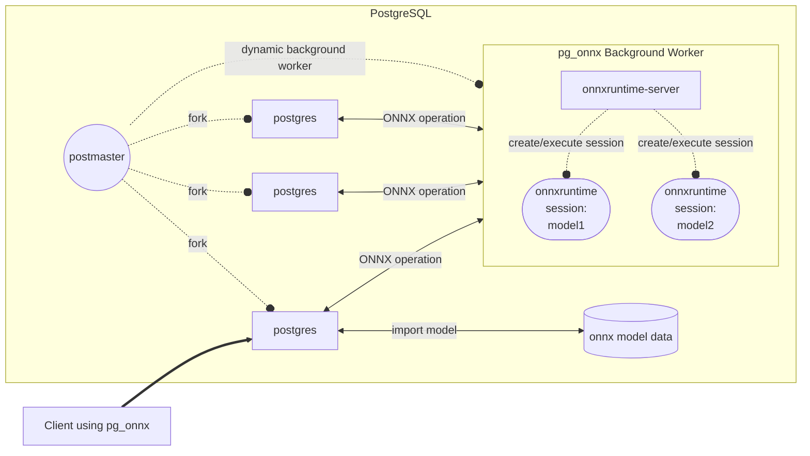

# pg_onnx

[](https://github.com/kibae/pg_onnx/actions/workflows/cmake-linux.yml)
[](https://github.com/kibae/pg_onnx/actions/workflows/cmake-macos.yml)
[](https://github.com/kibae/pg_onnx/blob/main/LICENSE)

- [ONNX: Open Neural Network Exchange](https://onnx.ai/)
- **ONNX Runtime integrated with PostgreSQL. Allows ML inference with information in the database.**
- PostgreSQL creates a process every new client connects. If every process ran ONNX inference, the system and GPU would
  run out of memory.
- So pg_onnx runs **[onnxruntime-server](https://github.com/kibae/onnxruntime-server)** as a background worker and
  creates and recycles one onnx runtime session per ONNX
  file.



----

<!-- TOC -->

- [Build pg_onnx](#build-pg_onnx)
    - [Requirements](#requirements)
    - [Install ONNX Runtime](#install-onnx-runtime)
    - [Install dependencies](#install-dependencies)
    - [Compile and Install](#compile-and-install)
- [How to use](#how-to-use)
    - [Install extension](#install-extension)
    - [Simple Usage](#simple-usage)
    - [Using inference results with triggers](#using-inference-results-with-triggers)
- [Functions](#functions)
    - [ONNX Model Functions](https://github.com/kibae/pg_onnx/wiki/Functions#onnx-model-functions)
        - [pg_onnx_import_model(TEXT, TEXT, BYTEA, JSONB, TEXT)](https://github.com/kibae/pg_onnx/wiki/Functions#pg_onnx_import_modeltext-text-bytea-jsonb-text)
        - [pg_onnx_list_model()](https://github.com/kibae/pg_onnx/wiki/Functions#pg_onnx_list_model)
        - [pg_onnx_inspect_model_bin(BYTEA)](https://github.com/kibae/pg_onnx/wiki/Functions#pg_onnx_inspect_model_binbytea)
        - [pg_onnx_drop_model(TEXT, TEXT)](https://github.com/kibae/pg_onnx/wiki/Functions#pg_onnx_drop_modeltext-text)
    - [ONNX Session Functions](https://github.com/kibae/pg_onnx/wiki/Functions#onnx-session-functions)
        - [pg_onnx_list_session()](https://github.com/kibae/pg_onnx/wiki/Functions#pg_onnx_list_session)
        - [pg_onnx_create_session(TEXT, TEXT)](https://github.com/kibae/pg_onnx/wiki/Functions#pg_onnx_create_sessiontext-text)
        - [pg_onnx_execute(TEXT, TEXT, JSONB)](https://github.com/kibae/pg_onnx/wiki/Functions#pg_onnx_executetext-text-jsonb)

----

# Build pg_onnx

## Requirements

- [PostgreSQL](https://www.postgresql.org/)
- [ONNX Runtime](https://onnxruntime.ai/)
- [Boost](https://www.boost.org/)
- [CMake](https://cmake.org/)
- CUDA(*optional, for Nvidia GPU support*)

----

## Install ONNX Runtime

#### Linux

- Use `download-onnxruntime-linux.sh` script
    - This script downloads the latest version of the binary and install to `/usr/local/onnxruntime`.
    - Also, add `/usr/local/onnxruntime/lib` to `/etc/ld.so.conf.d/onnxruntime.conf` and run `ldconfig`.
- Or manually download binary from [ONNX Runtime Releases](https://github.com/microsoft/onnxruntime/releases).

#### Mac OS

```shell
brew install onnxruntime
```

----

## Install dependencies

#### Ubuntu/Debian

```shell
sudo apt install cmake libboost-all-dev libpq-dev postgresql-server-dev-all
# optional, for Nvidia GPU support
sudo apt install nvidia-cuda-toolkit nvidia-cudnn
```

#### Mac OS

```shell
brew install cmake boost postgresql
```

----

## Compile and Install

#### Git clone

- Clone the repository with submodules.
    - [ONNX Runtime Server](https://github.com/kibae/onnxruntime-server) is included as a submodule.
    - If you already cloned the repository, run `git submodule update --init --recursive` to update submodules.

```shell
git clone --recursive https://github.com/kibae/pg_onnx.git
```

```shell
cmake -B build -S . -DCMAKE_BUILD_TYPE=Release
cmake --build build --target pg_onnx --parallel
sudo cmake --install build/pg_onnx
```

----

# How to use

## Install extension

```sql
CREATE EXTENSION IF NOT EXISTS pg_onnx;
```

## Simple Usage

- Import an ONNX file and get the inference results.

```sql
SELECT pg_onnx_import_model(
        'sample_model', --------------- model name
        'v20230101', ------------------ model version 
        PG_READ_BINARY_FILE('/your_model_path/model.onnx')::bytea, -- model binary data
        '{"cuda": true}'::jsonb, ------ options
        'sample model' ---------------- description
    );

SELECT pg_onnx_execute(
        'sample_model', -- model name
        'v20230101', ----- model version
        '{
          "x": [[1], [2], [3]],
          "y": [[3], [4], [5]],
          "z": [[5], [6], [7]]
        }' --------------- inputs
    );
```

- Depending on the type and shape of the inputs and outputs of the ML model, you can see different results. Below is an
  example of the result.

```
                            pg_onnx_execute                             
--------------------------------------------------------------------------------
 {"output": [[0.7488641738891602], [0.8607008457183838], [0.9725375175476074]]}
```

## Using inference results with triggers

- When data is added, use the BEFORE INSERT trigger to update some columns with ML inference results.
- *Depending on your ML model, this can have a significant performance impact, so be careful when using it.*

```sql
-- Create a test table
CREATE TABLE trigger_test
(
    id         SERIAL PRIMARY KEY,
    value1     INT,
    value2     INT,
    value3     INT,
    prediction FLOAT
);

-- Create a trigger function
CREATE OR REPLACE FUNCTION trigger_test_insert()
    RETURNS TRIGGER AS
$$
DECLARE
    result jsonb;
BEGIN
    result := pg_onnx_execute(
            'sample_model', 'v20230101',
            JSONB_BUILD_OBJECT(
                    'x', ARRAY [[NEW.value1]],
                    'y', ARRAY [[NEW.value2]],
                    'z', ARRAY [[NEW.value3]]));

    -- output shape: float[-1,1]
    -- eg: {"output": [[0.6492120623588562]]}
    NEW.prediction := result -> 'output' -> 0 -> 0;
    RETURN NEW;
END;
$$
    LANGUAGE plpgsql;

-- Create a trigger
CREATE TRIGGER trigger_test_insert
    BEFORE INSERT
    ON trigger_test
    FOR EACH ROW
EXECUTE PROCEDURE trigger_test_insert();
```

----

# Functions

- Provides several functions for importing ONNX file and executing and managing it.
- [ONNX Model Functions](https://github.com/kibae/pg_onnx/wiki/Functions#onnx-model-functions)
    - [pg_onnx_import_model(TEXT, TEXT, BYTEA, JSONB, TEXT)](https://github.com/kibae/pg_onnx/wiki/Functions#pg_onnx_import_modeltext-text-bytea-jsonb-text)
    - [pg_onnx_list_model()](https://github.com/kibae/pg_onnx/wiki/Functions#pg_onnx_list_model)
    - [pg_onnx_inspect_model_bin(BYTEA)](https://github.com/kibae/pg_onnx/wiki/Functions#pg_onnx_inspect_model_binbytea)
    - [pg_onnx_drop_model(TEXT, TEXT)](https://github.com/kibae/pg_onnx/wiki/Functions#pg_onnx_drop_modeltext-text)
- [ONNX Session Functions](https://github.com/kibae/pg_onnx/wiki/Functions#onnx-session-functions)
    - [pg_onnx_list_session()](https://github.com/kibae/pg_onnx/wiki/Functions#pg_onnx_list_session)
    - [pg_onnx_create_session(TEXT, TEXT)](https://github.com/kibae/pg_onnx/wiki/Functions#pg_onnx_create_sessiontext-text)
    - [pg_onnx_execute(TEXT, TEXT, JSONB)](https://github.com/kibae/pg_onnx/wiki/Functions#pg_onnx_executetext-text-jsonb)
